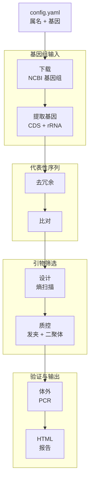

# AmPrime

[](https://github.com/Xinming9606/AmPrime/actions/workflows/ci.yml)
[](https://github.com/Xinming9606/AmPrime/actions/workflows/release.yml)
[](https://pixi.sh)


[](LICENSE)

AmPrime 利用 NCBI 公共基因组，为细菌持家基因（housekeeping gene）设计并验证扩增子测序（amplicon-sequencing）引物对。

只需提供：

- 一个细菌属名，例如 `Borrelia`
- 一个或多个目标基因，例如 `recG`、`clpA`，或一组 MLST 基因

它会为每个基因返回一份自包含的 HTML 报告，内容包括推荐引物对、体外 PCR（in silico PCR）与物种层面的验证、序列多样性图，以及所有候选引物对。当配置了多个基因时，它还会额外生成一份跨基因对比报告。

## 适用场景

当你需要为某个细菌属做可复现的「第一轮」引物设计工作流——尤其是希望设计出的引物能覆盖该属内众多基因组时，AmPrime 是合适的选择。

它目前还不是一个完整的特异性检查工具。现有流程会检查最优质的、通过 QC 的候选引物能否扩增目标属内的基因组，但**尚未**检测属外的脱靶（off-target）扩增。

## 快速开始

```bash
# 1. 克隆仓库
git clone git@github.com:Xinming9606/AmPrime.git
cd AmPrime

# 2. 如未安装 Pixi，先安装：https://pixi.sh

# 3. 预览将要执行的工作
pixi run dry-run

# 4. 编辑 config/config.yaml
# 设置你的属名、基因，以及可选的基因别名。

# 5. 运行流程
pixi run pipeline
```

报告会写入：

```text
results/<genus>/reports/<gene>_report.html
```

用浏览器打开该 HTML 文件，即可查看推荐引物对与验证摘要。

## 安装与环境

推荐使用 Pixi。它会根据 [pixi.toml](pixi.toml) 创建 conda/bioconda 环境，并通过 `pixi.lock` 保证运行可复现。锁定支持的平台为 Linux、macOS 与 Windows。

```bash
pixi install
```

验证工作流及其命令行工具是否就绪：

```bash
# Snakemake 能正确解析工作流
pixi run dry-run

# 流程所使用的外部工具（见「依赖要求」）
vsearch --version
muscle --version
seqkit version
```

在 Ubuntu 与 Apple Silicon macOS 上，Pixi 会自动安装 VSEARCH、MUSCLE 和 SeqKit。在 Windows 上，请通过 Scoop 安装（见[依赖要求](#依赖要求)）。

如果你更倾向于 micromamba/conda，也有一份 legacy 环境文件镜像了默认的 Pixi 依赖：

```bash
micromamba env create -f workflow/envs/environment.yaml
micromamba activate amprime
snakemake --cores 4
```

## 配置

所有面向用户的设置都位于 [config/config.yaml](config/config.yaml)。

最小示例：

```yaml
genus: Borrelia

genes:
  - recG
  - clpA
  - uvrA

assembly_level: complete
primer_len: 20
amplicon_min_len: 300
amplicon_max_len: 1000
div_cut: 2.0
GC_tol: 0.1

pcr_mismatch: 3
pcr_top_n: 10
max_primer_pairs: 100000
```

常用选项：

| 设置项                                 | 含义                                                              |
| -------------------------------------- | ----------------------------------------------------------------- |
| `genus`                                | NCBI 认可的细菌属名。                                             |
| `genes`                                | 一个或多个基因名。每个基因独立处理。                              |
| `assembly_level`                       | NCBI 组装级别：`complete`、`chromosome`、`scaffold` 或 `contig`。 |
| `primer_len`                           | 引物长度（bp）。                                                  |
| `amplicon_min_len`, `amplicon_max_len` | 目标扩增子长度范围。                                              |
| `div_cut`                              | 保守引物窗口允许的最大 Shannon 熵。找不到引物时可适当调高。       |
| `GC_tol`                               | 正反向引物 GC 含量的最大允许差值。                                |
| `pcr_mismatch`                         | 体外 PCR 中每条引物允许的错配数。                                 |
| `pcr_top_n`                            | 确定报告推荐前，需要验证的、通过 QC 的引物对数量。                |
| `max_primer_pairs`                     | 引物设计阶段保留的、经过评分的最大引物对数量。                    |

如果某个基因在不同基因组中使用了不同的注释名，可以添加别名：

```yaml
gene_aliases:
  tuf:
    - tsf
  16S:
    - "16S ribosomal RNA"
```

也可以针对特定基因单独覆盖多样性阈值：

```yaml
div_cut_per_gene:
  16S: 3.0
  rpoB: 1.5
```

## 阅读报告

主要交付物是 `results/<genus>/reports/<gene>_report.html`。针对单个基因，它展示了：

- 推荐引物对（含正反向引物序列）
- 推荐引物对的体外 PCR 与物种层面验证
- 逐位点 Shannon 熵图，并标记了首选引物位点
- 所有经过评分的候选引物对

当配置了多个基因时，`results/<genus>/reports/gene_report_cross.html` 会跨基因对比扩增与物种层面的指标。

某个属的所有输出文件都位于 `results/<genus>/` 下：

| 文件                                 | 内容                                                       |
| ------------------------------------ | ---------------------------------------------------------- |
| `reports/<gene>_report.html`         | 主要交付物：推荐、PCR/物种验证、绘图与候选。               |
| `reports/gene_report_cross.html`     | 跨基因的扩增与物种层面指标对比。                           |
| `genomes/download_manifest.tsv`      | 下载清单，含 FASTA 计数、大小、config SHA-256 与数据指纹。 |
| `aligned/<gene>.alignment.tsv`       | MUSCLE 版本与比对元数据。                                  |
| `primers/<gene>_primers.tsv`         | 按得分排序的、经过筛选的候选引物对。                       |
| `primers/<gene>_amplicons.tsv`       | 排名靠前的已验证候选引物的体外 PCR 结果，最优在前。        |
| `primers/<gene>_species_summary.tsv` | 物种层面扩增、等位基因多样性及跨物种重叠指标。             |
| `primers/<gene>_species.tsv`         | 逐物种的扩增子等位基因与重叠摘要。                         |
| `primers/<gene>_diversity.png`       | 逐位点 Shannon 熵图，标记首选引物位点。                    |
| `logs/...`                           | 各步骤日志，用于调试。                                     |
| `benchmarks/...`                     | Snakemake 基准（benchmark）文件。                          |

## 工作原理

AmPrime 对每个基因独立执行如下流程：



缺失的基因会被优雅地处理。如果某个基因无法找到，流程会继续执行，并生成一份显示「无可用候选」的报告。

## 依赖要求

工作流依赖声明在 [pixi.toml](pixi.toml) 中；legacy 的 [workflow/envs/environment.yaml](workflow/envs/environment.yaml) 为 micromamba/conda 用户镜像了相同依赖。

两个文件都包含相同的默认运行时依赖：Snakemake（`snakemake-minimal`）、Python 3.12、Biopython、NumPy、Matplotlib（`matplotlib-base`）、`ncbi-genome-download`、PyYAML、Python `markdown`、VSEARCH、MUSCLE 与 SeqKit。开发/检查工具 Ruff 与 `ty` 也同时在两个文件中固定了版本。

三个命令行工具按平台安装：

| 工具    | Ubuntu / Apple Silicon macOS | Windows         |
| ------- | ---------------------------- | --------------- |
| VSEARCH | 由 `pixi install` 安装       | 通过 Scoop 安装 |
| MUSCLE  | 由 `pixi install` 安装       | 通过 Scoop 安装 |
| SeqKit  | 由 `pixi install` 安装       | 通过 Scoop 安装 |

### Windows 命令行工具

在 Windows 上，先安装 Scoop，然后运行：

```powershell
scoop bucket add main-plus https://github.com/Scoopforge/Main-Plus
scoop install vsearch muscle seqkit
```

## 故障排查

如果 dry run 失败，请确认你是在仓库根目录下运行：

```bash
snakemake -n
```

如果找不到引物，可以尝试以下一种或多种方法：

- 调高 `div_cut`
- 放宽 `GC_tol`
- 在 `gene_aliases` 下添加基因别名
- 使用更宽松的 `assembly_level`
- 查看 `results/<genus>/logs/` 下逐基因日志

如果基因组下载失败，请确认属名能被 NCBI 识别，且网络连接正常。

如果测试数据集校验报告了校验和不匹配，请删除归档文件及其 `.json` 伴生文件，然后用 `pixi run download-ci-test-data` 重新生成。

如果批量运行较慢，请查看 `results/<genus>/logs/` 与 `results/<genus>/benchmarks/` 下的逐步骤日志与基准。Python 序列步骤会记录输入序列数、代表序列（centroid）数、扫描的基因组碱基数与耗时。首次测试大型属时，建议先使用更严格的组装级别（如 `complete`）、更小的基因集，或更低的 `pcr_top_n`。

查看报告或 `results/<genus>/aligned/<gene>.alignment.tsv`，即可获知比对所用的 MUSCLE 可执行文件与版本。

## 开发

### 设计说明

Snakemake 被刻意保持为一个「轻量调度器」。它负责管理依赖、并行执行、日志、基准与断点续跑。真正的计算由 `workflow/scripts/` 下的独立 Python 命令行工具完成。共享的 `dependencies.py` 模块负责检测 VSEARCH、MUSCLE 与 SeqKit，并在 Windows 上通过 Scoop 安装缺失的工具。

下载输出会在下载规则运行时作为一个整体刷新，因此上一次属名或组装级别遗留的过期 FASTA 文件不会混入新的运行。聚类始终使用 VSEARCH 以 97% 相似度进行，代表性序列用 MUSCLE 比对。比对运行会在比对文件旁写入一份小的元数据 TSV，记录 MUSCLE 可执行文件与版本。同样的比对摘要也会写入每份 HTML 报告，便于对运行进行审计。

基因提取是对所有配置基因的一次性批量扫描，避免了对整个 CDS/RNA 目录逐基因重扫。体外 PCR 将基因组分批送入 SeqKit `locate` 调用，对每个候选位点搜索两条链，重建所有有效的引物位点配对，并在 Python 中聚合确定性的报告指标。工作流规则声明了线程与内存需求；Pixi 便捷任务将调度内存上限设为 8 GB。`performance-smoke` 任务在处理大型属之前，用于防范明显的性能回退。

每个步骤都可以独立测试与调试：

```bash
python workflow/scripts/gene_extract.py --help
python workflow/scripts/primers_design.py --help
python workflow/scripts/gene_report.py --help
```

### 常用命令

```bash
pixi run compile
pixi run metadata-check
pixi run lint
pixi run format-check
pixi run ty-check
pixi run ensure-dependencies
pixi run performance-smoke
pixi run smoke
pixi run dry-run
pixi run pipeline
pixi run ci
pixi run functional-test
pixi run functional-test-ci
pixi run download-ci-test-data   # 仅 CI 使用：拉取并缓存参考测试数据集
pixi run source-archive
pixi run conda-build
pixi run conda-install-test
```

- `source-archive` 在 `dist/` 下生成源码 `.zip` 与 `.tar.gz` 归档。
- `conda-build` 在 `dist/conda/` 下生成本地 conda 包。
- `conda-install-test` 构建 `amprime`，将其发布到 `dist/conda-channel/` 下的本地 conda 频道，安装进一个全新的 Pixi 消费项目，检查 `amprime` 命令，验证打包的 config/workflow 资源，执行一次 Snakemake dry run，并针对仓库夹具执行功能测试。
- `metadata-check` 保证镜像的项目元数据一致：包名与版本必须在 `pixi.toml` 与 `pyproject.toml` 间一致，conda 运行时依赖必须保留在 `pixi.toml` 中，且 legacy 的 `environment.yaml` 必须镜像默认的 Pixi 环境。
- `download-ci-test-data` 供 CI 拉取并缓存 Borrelia 参考数据集；本地运行不会访问 NCBI。

### Python API

你也可以通过轻量 Python API 调用工作流：

```python
from amprime import AmPrimeProject

project = AmPrimeProject()
result = project.run_functional_test()
print(result.report_html)
```

安装 conda 包后，同样的 API 以 `amprime` 命令的形式暴露：

```bash
amprime functional-test
amprime verify --genus Borrelia --gene recG
```

### 项目结构

```text
AmPrime/
|-- Snakefile
|-- pixi.toml
|-- pixi.lock
|-- pyproject.toml
|-- config/
|   `-- config.yaml
|-- tools/            # 开发与发布辅助脚本
|-- amprime/          # 已安装的 Python 包
|-- workflow/
|   |-- Snakefile
|   |-- rules/        # Snakemake 规则
|   |-- scripts/      # 独立的 Python 命令行工具
|   `-- envs/         # legacy environment.yaml
`-- results/          # 生成的输出（不纳入版本控制）
```

GitHub Actions 工作流会在运行 `pixi run ci` 前下载并缓存 Borrelia 测试归档；该归档配有一份 SHA-256 伴生文件和一个显式的缓存快照版本。刷新参考数据集时，请同步更新工作流中的该版本号。本地 `pixi run ci` 不会访问 NCBI。推送形如 `v0.1.0` 的标签会触发 release 工作流，验证一次干净的 conda 包安装，在 `dist/` 下构建源码归档与 conda 包，将其作为工作流产物上传，并附到 GitHub Release。

## 局限性

- 尚未检测目标属以外的脱靶特异性。
- 引物序列采用多数一致（majority-rule consensus）与 IUPAC 表示；
  Shannon 熵是基于每列比对中观测到的 A/C/G/T 碱基独立计算的。
- 多序列比对需要 MUSCLE。
- 简并碱基的处理较为保守。
- 即使采用分批的 SeqKit 验证，处理非常大的属仍可能在下载、比对与扫描上耗时较长。

## 许可证

详见 [LICENSE](LICENSE)。
