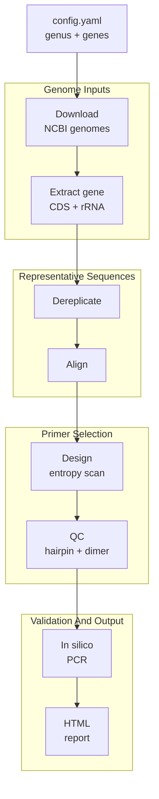

# AmPair

[](https://github.com/Xinming9606/AmPair/actions/workflows/ci.yml)
[](https://github.com/Xinming9606/AmPair/actions/workflows/release.yml)
[](https://pixi.sh)


[](LICENSE)

AmPair designs and validates amplicon-sequencing primer pairs for bacterial housekeeping genes using public NCBI genomes.

You give it:

- a bacterial genus, such as `Borrelia`
- one or more target genes, such as `recG`, `clpA`, or an MLST gene set

It returns one self-contained HTML report per gene with the recommended primer pair, in silico PCR and species-level validation, a sequence diversity plot, and all candidate primer pairs. When multiple genes are configured, it also writes a compact cross-gene comparison report.

> **Usage, configuration, and operations:** see [USAGE.md](USAGE.md).

## Setup

Pixi is the recommended setup. It creates the conda/bioconda environment from
[pixi.toml](pixi.toml) and keeps runs reproducible with `pixi.lock`. The locked
platforms are Linux, macOS, and Windows.

```bash
pixi install
```

Verify that the workflow and its command-line tools are available:

```bash
# Snakemake resolves the workflow
pixi run dry-run

# External tools used by the pipeline (see Requirements)
vsearch --version
muscle --version
seqkit version
```

Pixi installs VSEARCH, MUSCLE, and SeqKit automatically on Ubuntu and macOS. On
Windows, install them through Scoop (see [USAGE.md](USAGE.md#8-requirements)).

If you prefer micromamba/conda, a legacy environment file mirrors the default
Pixi dependencies:

```bash
micromamba env create -f workflow/envs/environment.yaml
micromamba activate ampair
snakemake --cores 4
```

### Default vs dev environment

The default Pixi environment contains only the runtime dependencies needed to
run the pipeline (`python`, `numpy`, `matplotlib-base`, `pyyaml`,
`ncbi-genome-download`, `markdown`, `snakemake-minimal`, and the platform
tools VSEARCH/MUSCLE/SeqKit). Lint/type-check tools (`ruff`, `ty`) are isolated
in the `dev` feature:

```bash
pixi install            # default environment only (lean)
pixi install -e dev     # also installs ruff and ty
```

## When To Use

Use AmPair when you want a reproducible first-pass primer design workflow for a bacterial genus, especially when you want primers that should work across many genomes within that genus.

It is not a full specificity checker yet. The current pipeline checks whether the best QC-passed primer candidates amplify genomes inside the target genus, but it does not test off-target amplification outside the genus.

## How It Works

For each gene independently, AmPair runs this pipeline:



Missing genes are handled gracefully. If a gene cannot be found, the pipeline continues and writes a report showing that no candidates were available.

## Requirements

The workflow dependencies are declared in [pixi.toml](pixi.toml); the legacy [workflow/envs/environment.yaml](workflow/envs/environment.yaml) mirrors them for micromamba/conda users. The default runtime is Snakemake (`snakemake-minimal`), Python, NumPy, Matplotlib (`matplotlib-base`), `ncbi-genome-download`, PyYAML, Python `markdown`, VSEARCH, MUSCLE, and SeqKit. See [USAGE.md](USAGE.md#8-requirements) for platform-specific tool installation.

## Limitations

- Off-target specificity outside the target genus is not checked yet.
- Primer sequences use a majority-rule consensus and IUPAC representation;
  Shannon entropy is calculated independently from the observed A/C/G/T bases
  in each alignment column.
- MUSCLE is required for multiple sequence alignment.
- Degenerate-base handling is conservative.
- Very large genera can take a long time to download, align, and scan even with batched SeqKit validation.

## License

See [LICENSE](LICENSE).
