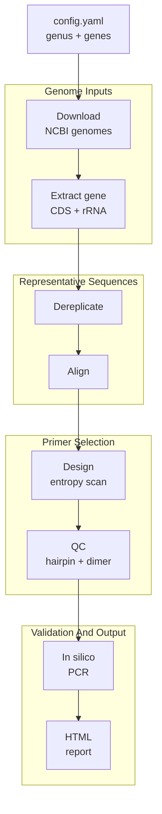

# AmPair

[](https://github.com/Xinming9606/AmPair/actions/workflows/ci.yml)
[](https://github.com/Xinming9606/AmPair/actions/workflows/release.yml)
[](https://pixi.sh)


[](LICENSE)

AmPair designs and validates amplicon-sequencing primer pairs for bacterial housekeeping genes using public NCBI genomes.

You give it:

- a bacterial genus, such as `Borrelia`
- one or more target genes, such as `recG`, `clpA`, or an MLST gene set

It returns one self-contained HTML report per gene with the recommended primer pair, in silico PCR and species-level validation, a sequence diversity plot, and all candidate primer pairs. When multiple genes are configured, it also writes a compact cross-gene comparison report.

## When To Use

Use AmPair when you want a reproducible first-pass primer design workflow for a bacterial genus, especially when you want primers that should work across many genomes within that genus.

It is not a full specificity checker yet. The current pipeline checks whether the best QC-passed primer candidates amplify genomes inside the target genus, but it does not test off-target amplification outside the genus.

## Quick Start

```bash
# 1. Clone the repository
git clone git@github.com:Xinming9606/AmPair.git
cd AmPair

# 2. Install Pixi if needed: https://pixi.sh

# 3. Preview the work to be done
pixi run dry-run

# 4. Edit config/config.yaml
# Set your genus, genes, and optional gene aliases.

# 5. Run the pipeline
pixi run pipeline
```

Reports are written to:

```text
results/<genus>/reports/<gene>_report.html
```

Open the HTML file in a browser to inspect the recommended primer pair and validation summary.

## Setup

Pixi is the recommended setup. It creates the conda/bioconda environment from [pixi.toml](pixi.toml) and keeps runs reproducible with `pixi.lock`. The locked platforms are Linux, macOS, and Windows.

```bash
pixi install
```

Verify that the workflow and its command-line tools are available:

```bash
# Snakemake resolves the workflow
pixi run dry-run

# External tools used by the pipeline (see Requirements)
vsearch --version
muscle --version
seqkit version
```

Pixi installs VSEARCH, MUSCLE, and SeqKit automatically on Ubuntu and macOS. On Windows, install them through Scoop (see [Requirements](#requirements)).

If you prefer micromamba/conda, a legacy environment file mirrors the default Pixi dependencies:

```bash
micromamba env create -f workflow/envs/environment.yaml
micromamba activate ampair
snakemake --cores 4
```

## Configuration

All user-facing settings live in [config/config.yaml](config/config.yaml).

Minimal example:

```yaml
genus: Borrelia

genes:
  - recG
  - clpA
  - uvrA

assembly_level: complete
primer_len: 20
amplicon_min_len: 300
amplicon_max_len: 1000
div_cut: 2.0
GC_tol: 0.1

pcr_mismatch: 3
pcr_top_n: 10
max_primer_pairs: 100000
```

Useful options:

| Setting                                | Meaning                                                                                         |
| -------------------------------------- | ----------------------------------------------------------------------------------------------- |
| `genus`                                | Bacterial genus name recognized by NCBI.                                                        |
| `genes`                                | One or more gene names. Each gene is processed independently.                                   |
| `assembly_level`                       | NCBI assembly level: `complete`, `chromosome`, `scaffold`, or `contig`.                         |
| `primer_len`                           | Primer length in bp.                                                                            |
| `amplicon_min_len`, `amplicon_max_len` | Target amplicon size range.                                                                     |
| `div_cut`                              | Maximum Shannon entropy allowed for conserved primer windows. Raise it if no primers are found. |
| `GC_tol`                               | Maximum GC fraction difference between forward and reverse primers.                             |
| `pcr_mismatch`                         | Mismatches allowed per primer during in silico PCR.                                             |
| `pcr_top_n`                            | Number of QC-passed primer pairs to validate before choosing the report recommendation.         |
| `max_primer_pairs`                     | Maximum number of scored primer pairs retained by primer design.                                |

If a gene is annotated under different names across genomes, add aliases:

```yaml
gene_aliases:
  tuf:
    - tsf
  16S:
    - "16S ribosomal RNA"
```

You can also override the diversity cutoff for specific genes:

```yaml
div_cut_per_gene:
  16S: 3.0
  rpoB: 1.5
```

## Reading the Report

The main deliverable is `results/<genus>/reports/<gene>_report.html`. It shows, for one gene:

- the recommended primer pair, with forward and reverse sequences
- in silico PCR and species-level validation of the recommended pair
- a per-position Shannon entropy plot with the top primer sites marked
- all scored candidate primer pairs

When multiple genes are configured, `results/<genus>/reports/gene_report_cross.html` compares amplification and species-level metrics across genes.

All output files for a genus live under `results/<genus>/`:

| File                                 | Contents                                                                             |
| ------------------------------------ | ------------------------------------------------------------------------------------ |
| `reports/<gene>_report.html`         | Main deliverable: recommendation, PCR/species validation, plot, and candidates.      |
| `reports/gene_report_cross.html`     | Cross-gene comparison of amplification and species-level metrics.                    |
| `genomes/download_manifest.tsv`      | Download manifest with FASTA counts, sizes, config SHA-256, and data fingerprints.   |
| `aligned/<gene>.alignment.tsv`       | MUSCLE version and alignment metadata.                                               |
| `primers/<gene>_primers.tsv`         | Filtered candidate primer pairs ranked by score.                                     |
| `primers/<gene>_amplicons.tsv`       | In silico PCR results for the top validated primer candidates, sorted best first.    |
| `primers/<gene>_species_summary.tsv` | Species-level amplification, allele multiplicity, and inter-species overlap metrics. |
| `primers/<gene>_species.tsv`         | Per-species amplicon allele and overlap summary.                                     |
| `primers/<gene>_diversity.png`       | Per-position Shannon entropy plot with top primer sites marked.                      |
| `logs/...`                           | Per-step logs for debugging.                                                         |
| `benchmarks/...`                     | Snakemake benchmark files.                                                           |

## How It Works

For each gene independently, AmPair runs this pipeline:



Missing genes are handled gracefully. If a gene cannot be found, the pipeline continues and writes a report showing that no candidates were available.

## Requirements

The workflow dependencies are declared in [pixi.toml](pixi.toml); the legacy [workflow/envs/environment.yaml](workflow/envs/environment.yaml) mirrors them for micromamba/conda users.

Both files include the same default runtime: Snakemake (`snakemake-minimal`), Python, NumPy, Matplotlib (`matplotlib-base`), `ncbi-genome-download`, PyYAML, Python `markdown`, VSEARCH, MUSCLE, and SeqKit. The development/checking tools Ruff and `ty` are also pinned in both files.

The three command-line tools are installed by platform:

| Tool    | Ubuntu / macOS              | Windows                 |
| ------- | --------------------------- | ----------------------- |
| VSEARCH | Installed by `pixi install` | Installed through Scoop |
| MUSCLE  | Installed by `pixi install` | Installed through Scoop |
| SeqKit  | Installed by `pixi install` | Installed through Scoop |

### Windows command-line tools

On Windows, install Scoop first, then run:

```powershell
scoop bucket add main-plus https://github.com/Scoopforge/Main-Plus
scoop install vsearch muscle seqkit
```

## Troubleshooting

If the dry run fails, check that you are running from the repository root:

```bash
snakemake -n
```

If no primers are found, try one or more of the following:

- raise `div_cut`
- relax `GC_tol`
- add gene aliases under `gene_aliases`
- use a less restrictive `assembly_level`
- inspect the per-gene logs under `results/<genus>/logs/`

If genome download fails, confirm that the genus name is recognized by NCBI and that your internet connection is available.

If the test dataset check reports a checksum mismatch, remove the archive and its `.json` sidecar, then regenerate them together with `pixi run download-ci-test-data`.

If a batch run is slow, inspect the per-step logs and benchmarks under `results/<genus>/logs/` and `results/<genus>/benchmarks/`. The Python sequence steps log input sequence counts, centroid counts, scanned genome bases, and elapsed time. Start with a stricter assembly level such as `complete`, a smaller gene set, or a lower `pcr_top_n` when first testing a large genus.

Check the report or `results/<genus>/aligned/<gene>.alignment.tsv` to see the MUSCLE executable and version used for alignment.

## Development

### Design notes

Snakemake is intentionally kept as a thin scheduler. It manages dependencies, parallel execution, logs, benchmarks, and resumability. The actual work is done by standalone Python command-line tools in `workflow/scripts/`. The shared `dependencies.py` module detects VSEARCH, MUSCLE, and SeqKit and installs missing Windows tools through Scoop.

Download outputs are refreshed as a unit when the download rule runs, so stale FASTA files from a previous genus or assembly level do not mix into a new run. Clustering always uses VSEARCH at 97% identity, and representative sequences are aligned with MUSCLE. Alignment runs write a small metadata TSV next to the alignment, recording the MUSCLE executable and version. The same alignment summary is included in each HTML report so runs remain easy to audit.

Gene extraction is a single batch scan for all configured genes, avoiding a full CDS/RNA directory rescan per gene. In-silico PCR batches genomes into SeqKit `locate` invocations, searches both strands for every candidate site, reconstructs every valid primer-site pairing, and aggregates deterministic report metrics in Python. Workflow rules declare thread and memory requirements; the Pixi convenience tasks cap scheduled memory at 8 GB. The `performance-smoke` task guards against large regressions before very large genera are processed.

Each step is easy to test and debug in isolation:

```bash
python workflow/scripts/gene_extract.py --help
python workflow/scripts/primers_design.py --help
python workflow/scripts/gene_report.py --help
```

### Useful commands

```bash
pixi run compile
pixi run metadata-check
pixi run lint
pixi run format-check
pixi run ty-check
pixi run ensure-dependencies
pixi run performance-smoke
pixi run smoke
pixi run dry-run
pixi run pipeline
pixi run ci
pixi run functional-test
pixi run functional-test-ci
pixi run download-ci-test-data   # CI only: fetch and cache the reference test dataset
pixi run source-archive
pixi run conda-build
pixi run conda-install-test
```

- `source-archive` writes source `.zip` and `.tar.gz` archives under `dist/`.
- `conda-build` writes a local conda package under `dist/conda/`.
- `conda-install-test` builds `ampair`, publishes it to an indexed local conda channel under `dist/conda-channel/`, installs it into a fresh Pixi consumer project, checks the `ampair` command, verifies the bundled config/workflow resources, runs a Snakemake dry run, and executes the functional test against the repository fixture.
- `metadata-check` keeps mirrored project metadata honest: package names and versions must match across `pixi.toml` and `pyproject.toml`, conda runtime dependencies must stay in `pixi.toml`, and the legacy `environment.yaml` must mirror the default Pixi environment.
- `download-ci-test-data` is used by CI to fetch and cache the Borrelia reference dataset; local runs do not access NCBI.

### Python API

You can also call the workflow through the lightweight Python API:

```python
from ampair import AmPairProject

project = AmPairProject()
result = project.run_functional_test()
print(result.report_html)
```

After installing the conda package, the same API is exposed as the `ampair` command:

```bash
ampair functional-test
ampair verify --genus Borrelia --gene recG
```

### Project layout

```text
AmPair/
|-- Snakefile
|-- pixi.toml
|-- pixi.lock
|-- pyproject.toml
|-- config/
|   `-- config.yaml
|-- tools/            # development and release helper scripts
|-- ampair/           # the installed Python package
|-- workflow/
|   |-- Snakefile
|   |-- rules/        # Snakemake rules
|   |-- scripts/      # standalone Python command-line tools
|   `-- envs/         # legacy environment.yaml
`-- results/          # generated outputs (not committed)
```

The GitHub Actions workflow downloads and caches the Borrelia test archive before running `pixi run ci`; the archive is paired with a SHA-256 sidecar and an explicit cache snapshot version. Bump that version in the workflow when refreshing the reference dataset. Local `pixi run ci` does not access NCBI. Pushing a tag like `v0.1.0` runs the release workflow, verifies a clean conda-package install, builds source archives plus a conda package under `dist/`, uploads them as workflow artifacts, and attaches them to the GitHub Release.

## Limitations

- Off-target specificity outside the target genus is not checked yet.
- Primer sequences use a majority-rule consensus and IUPAC representation;
  Shannon entropy is calculated independently from the observed A/C/G/T bases
  in each alignment column.
- MUSCLE is required for multiple sequence alignment.
- Degenerate-base handling is conservative.
- Very large genera can take a long time to download, align, and scan even with batched SeqKit validation.

## License

See [LICENSE](LICENSE).
